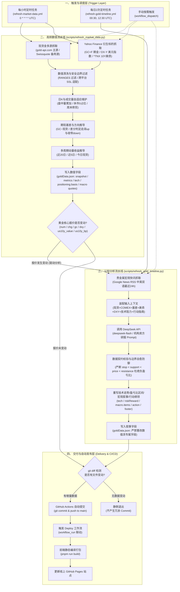

# 黄金板块数据拉取与认知分析模型架构

本文档详细梳理 MarketTracker 黄金板块（Gold）的完整数据拉取模型（Data Pipeline Model）。系统采用**“高频确定性数值流 + 事件驱动/定时认知分析流”**的双轨制架构，实现了从外部公开市场与新闻源抓取、数据清洗校验、大模型结构化研判，到 Git 自动提交发布的全自动化闭环。

---

## 1. 黄金数据架构全景图

---

## 2. 核心模块与管道详细说明

### 2.1 高频数值管道 (`scripts/refresh_market_data.py`)

- **执行周期**：每小时整点运行 (`.github/workflows/refresh-market-data.yml`)。
- **数据源**：
  - **伦敦金现货 (XAU/USD)**：主源 `https://api.gold-api.com/price/XAU`，备用源 Swissquote 外汇 BBO 柜台流（`https://forex-data-feed.swissquote.com`）；
  - **COMEX 黄金期货连续主力**：`GC=F`（Yahoo Finance）；
  - **美元指数**：`DX-Y.NYB`（Yahoo Finance）；
  - **美债 10 年期基准收益率**：`^TNX`（CBOE 10-Year Treasury Yield via Yahoo Finance）。
- **核心逻辑与防固机制**：
  1. **现货双源高可用与平滑降级**：优先拉取 `gold-api.com` 撮合成交价；遇到网络抖动或超时时自动故障转移至 Swissquote 中间价，并更新对应来源标签。
  2. **价格绝对窗口过滤 (`RANGES`)**：设定价格绝对边界防御（`500.0 ~ 20000.0`），排除传输损坏引发的极端脏数据。
  3. **日内盘中成交量动态累加 (`update_gold_candles`)**：在同一交易日内持续以 COMEX 当日实时成交量刷新 `volumes[-1]`，消除早盘首笔读数被全天冻结的 Bug。
  4. **休市日前向填充防伪造**：当遇到交易所假期或成交量缺失时，追加 `0` 手占位符，坚决杜绝用前日数据前向填充造成的虚假放量。
  5. **期现基差差分方向判定 (`update_basis_row`)**：以当前基差相较前次快照的增量差分（\(\Delta \text{Basis} = \text{Basis}_t - \text{Basis}_{t-1}\)）判定方向。差分大于 \(+0.05\) 标为走阔（`up`），小于 \(-0.05\) 标为收窄（`down`），微幅变动标为持平（`flat`），精准还原套利结构演变。
  6. **多周期动量时序闭环 (`update_momentum`)**：基于当前 94 根日 K 线精确计算近 20 交易日、近 5 交易日以及今日现货的涨跌幅。
- **写入字段**：
  - `src/data/goldData.json` 中的 `snapshot`、`metrics.main.*`、`benchmarks`、`premium`、`tech.candles`、`tech.volume`、`tech.momentum`、`sentiment.riskReward.price`、`positioning.table`（基差行）以及 `macro.items` 中的高频数值 `quote`。
  - **内外盘溢价与 Jev 死区防御**：在 `premium` 中实时测算 \(\text{Spread} = \frac{\text{Au99.99} \times 31.1035}{\text{USD/CNY}} - \text{XAU/USD}\)，基于 Jev 准则设立 \([-5, 8]\) 美元中性死区与偏强（HOT）、极端挤仓（SQUEEZE）和贴水（DISCOUNT）状态机。
  - **东西方需求侧分层**：日度追踪西方 SPDR 与国内华安黄金 ETF（518880）持仓，月度追踪中国央行（PBOC）官方储备与 SGE 出库量。
  - **严守边界**：绝不篡改认知流水线负责的 `tech.trend`、支撑阻力区间、宏观叙事 `v` 及 `action`。

---

### 2.2 认知分析管道 (`scripts/refresh_gold_timeline.py`)

- **执行机制（双模驱动）**：
  - **模式 A（报价驱动，实时联动）**：在每小时的 `refresh-market-data.yml` 中，内联比对黄金核心行情六元组 `(num, chg, gc, dxy, us10y_value, us10y_bp)`。一旦任一报价发生跳动，立即触发重写交易研判。
  - **模式 B（独立定时兜底，全面扫描）**：由 `.github/workflows/refresh-gold-timeline.yml` 每日在 00:30 与 12:30 UTC（北京时间 08:30 亚盘开盘前与 20:30 美盘开盘前）独立运行，捕获盘面横盘但宏观利率、央行或地缘政策突发重大事实的场景。
- **数据源**：
  - Google News RSS 黄金与宏观中英双语检索频道（`when:1d`，最近 24 小时内的 30~40 条即时权威快讯）。
- **LLM 研判与结构化提炼**：
  - **模型**：DeepSeek-V4.1-Flash (`deepseek-flash`)，基于仓库 Secret `DS_API_KEY`。
  - **系统提示词规范**：严格遵循 [`docs/editorial-guidelines.md`](../editorial-guidelines.md) 彭博终端 / 顶级投行卖方研报标准，严禁自媒体噱头、情绪化口语或无依据的投资建议。
  - **结构化提炼核心板块**：
    1. **价格形态与技术信号 (`tech`)**：
       - 根据最新现货点位自适应调整合理的支撑区间 `[min, max]` 与阻力区间 `[min, max]`；
       - 重写客观走势概览 `trend`、支撑带依据 `supportDesc` 与压力带依据 `resistanceDesc`。
    2. **盈亏比与空间结构自愈收敛 (`sentiment.riskReward`)**：
       - 强制进行数学边界校验与自愈收敛（Clamping），严格保证：
         \[
         0 < \text{Stop} < \text{Support} < \text{Price} < \text{Resistance}
         \]
       - 彻底杜绝现价跌破支撑时出现负下行距离或负盈亏比的业务事故。
    3. **宏观驱动因子与多空信号 (`macro_updates`)**：
       - 动态重写美债收益率、美元指数、加息预期、央行购金与地缘维度的定性研判 `v`；
       - 动态调整多空信号标签（`signal: bull / bear / flat`）及文案，消除盘面数值与分析文本脱节的矛盾。
    4. **当前行动准则 (`action`)**：
       - `summary`：提炼当前主导矛盾与防御/进攻核心基调；
       - `plans`：分别向「短线交易者」与「中长线 / 波段交易者」提供基于明确触发条件的仓位风控策略。
    5. **数据源快照说明 (`footer`)**：
       - 全量重编包含当次现货、期货、基差、美债和美元读数的事实快照页脚。
- **写入字段**：
  - 仅更新 `src/data/goldData.json` 中的 `tech.support`、`tech.resistance`、`tech.trend`、`supportDesc`、`resistanceDesc`、`sentiment.riskReward`（支撑/阻力/止损/说明）、`macro.items[].v/signal`、`action` 与 `footer`。
  - **异常回退**：模型调用失败、JSON 解析异常或边界防御校验未通过时，保持原状不写文件。

---

### 2.3 自动提交与云端发布管道 (Vercel Platform)

- **Git 自动化**：
  - 脚本执行后，工作流执行 `git diff --cached --quiet` 校验。
  - 仅当产生实际数据变动时，使用 `github-actions[bot]` 自动提交并推送至 `main` 分支。
- **下游构建联动与秒级推流**：
  - 代码推送到 `main` 分支后，由 Vercel 自动执行无感构建部署并推向全球 CDN 边缘节点。
  - 同时前端通过 `/api/quotes` 边缘函数直连盘中行情，用户访问即享准实时秒级更新。

---

## 3. 容错与数据一致性契约

| 潜在异常场景 | 系统容错与自愈策略 |
| :--- | :--- |
| **gold-api 现货接口故障或限流** | 自动捕获异常并平滑切换至 Swissquote BBO 柜台流；若双源均超时，保留上一周期有效报价，严禁写入 `null`。 |
| **金价大幅异动击穿支撑/阻力** | 认知管道内置 Clamping 夹紧自愈算法，动态重设区间，且前端 `GoldPanel.tsx` 增加 `Math.max(0, ...)` 与 `'已击穿'` / `'待重估'` 降级防护，杜绝负数展示。 |
| **COMEX 交易所节假日休市** | 成交量严禁前向复制填充前日数据，强制追加 `0` 手占位符，保持时序等长且方差纯净。 |
| **期现换月主力合约跳空** | 基于相邻快照差分判定基差变动，避免将正常的绝对升水误判为持续单边走阔。 |
| **DeepSeek API 临时抖动或网络超时** | 捕获异常并记录 WARN 日志，研判字段维持上一版本，绝不破坏底层 JSON 结构。 |
| **无重大增量新闻的空窗期** | DeepSeek 依据最新行情点位对齐微观结构，未通过校验时静默退出，避免无意义的 Commit 膨胀。 |
