# 原油板块数据拉取与认知分析模型架构

本文档详细梳理 MarketTracker 原油板块（Crude Oil）的完整数据拉取模型（Data Pipeline Model）。系统采用**“高频确定性数值流 + 事件驱动/定时认知分析流”**的双轨制架构，实现了从外部公开市场与新闻源抓取、数据清洗校验、大模型结构化研判，到 Git 自动提交发布的全自动化闭环。

---

## 1. 原油数据架构全景图

```mermaid
graph TD
    subgraph Triggers ["一、 触发与调度层 (Trigger Layer)"]
        cronHourly["每小时定时任务<br/>(refresh-market-data.yml<br/>0 * * * * UTC)"]
        cronTwiceDaily["每日2次定时任务<br/>(refresh-oil-timeline.yml<br/>00:30, 12:30 UTC)"]
        manualDispatch["手动按需触发<br/>(workflow_dispatch)"]
    end

    subgraph NumericalPipeline ["二、 高频数值流水线 (scripts/refresh_market_data.py)"]
        fetchYahoo["Yahoo Finance 多源抓取<br/>(BZ=F 布伦特 / CL=F WTI / DX-Y 美元指数)"]
        sanitizeNum["数值清洗与安全边界过滤<br/>(RANGES 过滤 / 跨平台 SSL 适配)"]
        reconcileSettlement["全图跨度结算价回补<br/>(reconcile_full_chart_span)"]
        pruneWeekend["非交易日自愈修剪<br/>(自动剔除周末并等长对齐)"]
        calcChange["真实昨收与涨跌幅推导<br/>(严格取上一有效交易日收盘)"]
        writeNumJson["写入数值字段<br/>(oilData.json: snapshot / metrics / charts)"]
        checkQuoteChange{"原油报价是否变动?<br/>(num / chg / wti / dxy)"}
    end

    subgraph NarrativePipeline ["三、 认知分析流水线 (scripts/refresh_oil_timeline.py)"]
        fetchRss["能源快讯抓取<br/>(Google News RSS 中英双语最近24h)"]
        readContext["装配输入上下文<br/>(最新盘面报价 + 已有时间轴近8条)"]
        callDeepSeek["调用 DeepSeek API<br/>(deepseek-flash / 机构研报 Prompt)"]
        validateModelJson["数据契约校验与清洗<br/>(JSON 格式 / 原文外链匹配 / 严禁自媒体词)"]
        mergeTimeline["时间轴增量更新<br/>(最新事件置顶 / 保持≤18条 / 修剪>30天)"]
        updateSignalRisks["重写市场信号与观察变量<br/>(verdict / sub / bull & bear / risks)"]
        writeNarrativeJson["写入叙事字段<br/>(oilData.json: timeline / signal / risks)"]
    end

    subgraph DeliveryPipeline ["四、 交付与自动发布层 (Delivery & CI/CD)"]
        gitDiffCheck{"git diff 检测<br/>是否有文件变动?"}
        gitCommitPush["GitHub Actions 自动提交<br/>(git commit & push to main)"]
        deployTrigger["触发 Deploy 工作流<br/>(workflow_run 联动)"]
        viteBuild["前端静态编译打包<br/>(pnpm run build)"]
        ghPagesDeploy["更新线上 GitHub Pages 站点"]
        noOp["静默退出<br/>(不产生冗余 Commit)"]
    end

    %% 触发连接
    cronHourly --> fetchYahoo
    manualDispatch -.-> fetchYahoo
    manualDispatch -.-> fetchRss
    cronTwiceDaily --> fetchRss

    %% 数值流水线连接
    fetchYahoo --> sanitizeNum
    sanitizeNum --> reconcileSettlement
    reconcileSettlement --> pruneWeekend
    pruneWeekend --> calcChange
    calcChange --> writeNumJson
    writeNumJson --> checkQuoteChange

    %% 事件驱动联动触发
    checkQuoteChange -->|"报价发生变动 (驱动分析)"| fetchRss
    checkQuoteChange -->|"报价未变动"| gitDiffCheck

    %% 认知分析流水线连接
    fetchRss --> readContext
    readContext --> callDeepSeek
    callDeepSeek --> validateModelJson
    validateModelJson --> mergeTimeline
    validateModelJson --> updateSignalRisks
    mergeTimeline --> writeNarrativeJson
    updateSignalRisks --> writeNarrativeJson
    writeNarrativeJson --> gitDiffCheck

    %% 交付流水线连接
    gitDiffCheck -->|"有增量数据"| gitCommitPush
    gitDiffCheck -->|"无数据变动"| noOp
    gitCommitPush --> deployTrigger
    deployTrigger --> viteBuild
    viteBuild --> ghPagesDeploy
```

---

## 2. 核心模块与管道详细说明

### 2.1 高频数值管道 (`scripts/refresh_market_data.py`)

- **执行周期**：每小时整点运行 (`.github/workflows/refresh-market-data.yml`)。
- **数据源**：
  - Yahoo Finance API（主节点 `query1.finance.yahoo.com`，备用节点 `query2.finance.yahoo.com`）；
  - 核心标的：`BZ=F`（ICE 布伦特原油连续合约）、`CL=F`（NYMEX WTI 原油连续合约）、`DX-Y.NYB`（美元指数）。
- **核心逻辑与防固机制**：
  1. **跨平台 SSL 自适应**：内置 `_ssl_context()`，本地环境优先使用 `certifi` CA 证书池，CI 容器使用系统证书，防止握手失败。
  2. **价格绝对窗口过滤**：通过 `RANGES` 校验，排除网络传输导致的极端坏点（如原油价格必须在 20~250 美元/桶之间）。
  3. **全图跨度结算价回补 (`reconcile_full_chart_span`)**：遍历图表中所有交易日，当交易所已产生最终官方日结算价时，自动覆写日内暂存盘中价，确保整张历史折线图（30+ 交易日）完全贴合交易所官方结算价。
  4. **非交易日自愈修剪**：检测并自动剔除周六、周日等非交易日标签，同步对齐 WTI、Brent 与 SC 序列长度，杜绝数组错位。
  5. **严格的交易日顺延**：美东时间周日晚盘交易（美东周日夜间对应北京时间周一上午）自动规范化归入周一交易日，避免生成虚假周末日线。
- **写入字段**：
  - `src/data/oilData.json` 中的 `snapshot`、`metrics.main.*`、`charts.*`。
  - **严守边界**：绝不改写 `signal`、`timeline`、`risks` 等叙事内容。

---

### 2.2 认知分析管道 (`scripts/refresh_oil_timeline.py`)

- **执行机制（双模驱动）**：
  - **模式 A（数据变动驱动，实时性）**：在每小时的 `refresh-market-data.yml` 中，如果 Python 比对发现原油报价（现价 `num`、涨跌 `chg`、WTI 或 DXY）较上一版本发生变化，立即触发执行，实现“报价变动 ➔ 结论联动重写”。
  - **模式 B（独立定时兜底，全面性）**：由 `.github/workflows/refresh-oil-timeline.yml` 每日在 00:30 与 12:30 UTC（北京时间 08:30 亚盘开盘前与 20:30 美盘开盘前）独立运行，捕获盘面报价震荡但外部地缘与供需出现关键快讯的情形。
- **数据源**：
  - Google News RSS 原油/能源中英双语检索频道（`when:1d`，最近 24 小时内的 30~40 条即时快讯）。
- **LLM 研判与结构化提炼**：
  - **模型**：DeepSeek-V4.1-Flash (`deepseek-flash`)，基于仓库 Secret `DS_API_KEY`。
  - **系统提示词规范**：严格遵守 [`docs/editorial-guidelines.md`](../editorial-guidelines.md) 机构标准，坚决剔除自媒体口语、说教与情绪化词汇。
  - **结构化提炼三大板块**：
    1. **时间轴 (`timeline`)**：
       - 对比已有时间轴，仅收录对供需、库存、航运或政策有实质增量的事实（最多 2 条）；
       - 强制要求条目附带来源报道的原始外链 `url`，前端渲染点击跳转图标；
       - 数组保持最多 18 条，自动修剪超过 30 天的历史事件。
    2. **市场信号 (`signal`)**：
       - `verdict`：一句定调当前主要矛盾（结合最新 `BZ=F`、`WTI` 涨跌幅与核心驱动因素）；
       - `sub`：阐明盘面与报道口径差异（如 BZ=F 金融期货与通讯社现货月基差）；
       - `bull` / `bear`：严谨提炼 3 条利多与 3 条利空因素（归类至 `geo` 地缘、`supply` 供给、`stocks` 库存、`macro` 宏观）；
       - `watch`：列明 4~6 个待核实的关键观察变量。
    3. **观察变量 (`risks`)**：
       - 提炼 3 条核心风险项，标明风险等级（`r` 红色警示、`a` 琥珀色观察、`g` 绿色正常）、触发条件与价格传导逻辑。
- **写入字段**：
  - 仅更新 `src/data/oilData.json` 中的 `timeline`、`signal`、`risks`、`risksTitle`。
  - **异常回退**：模型调用失败、未产生有效增量或字段校验未通过时，保持原状不写文件。

---

### 2.3 自动提交与云端发布管道 (Vercel Platform)

- **Git 自动化**：
  - 脚本执行后，工作流执行 `git diff --cached --quiet` 校验。
  - 仅当产生实际数据变动时，使用 `github-actions[bot]` 自动提交并推送至 `main` 分支。
- **下游构建联动与秒级推流**：
  - 代码推送到 `main` 分支后，由 Vercel 自动执行无感构建部署并推向全球 CDN 边缘节点。
  - 同时前端通过 `/api/quotes` 边缘函数直连盘中行情，用户访问即享准实时秒级更新。

---

## 3. 容错与数据一致性契约

| 潜在异常场景 | 系统容错与自愈策略 |
| :--- | :--- |
| **Yahoo Finance 接口偶发超时或限流** | 双域名自动轮换重试；若全部失败，保留上一小时有效报价，禁止写入 `null`。 |
| **盘中临时收盘价漂移** | 次小时或次日由全图结算价回补逻辑自动拉取官方最终结算价并平滑覆写。 |
| **周末夜盘时间戳跳跃** | 美东周日开市时间戳自动顺延对齐至周一，历史遗留周末标签在前置解析阶段自动修剪。 |
| **DeepSeek API 临时抖动或网络超时** | 捕获异常并记录 WARN 日志，叙述字段维持上一版本，绝不破坏底层 JSON 结构。 |
| **无重大新闻的空窗期** | DeepSeek 返回空事件数组，脚本直接跳过重写，避免无意义的同义反复或 Commit 膨胀。 |
