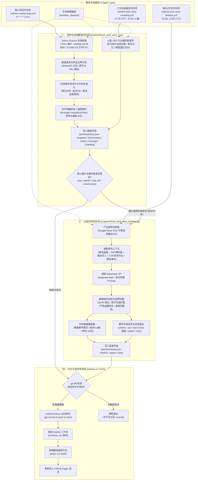

# 科技宏观半导体数据拉取与认知分析模型架构

本文档详细梳理 MarketTracker 科技宏观半导体板块（Tech Semi）的完整数据拉取模型（Data Pipeline Model）。系统采用**“高频确定性数值流 + 日频行业拥挤度 + 事件驱动/定时认知分析流”**的多轨制架构，实现了从外部公开市场行情与新闻源抓取、数据清洗校验、行业拥挤度推导、大模型结构化研判，到 Git 自动提交发布的全自动化闭环。

---

## 1. 科技宏观半导体数据架构全景图

---

## 2. 核心模块与管道详细说明

### 2.1 高频与日频数值管道

科技半导体板块的数值流由两组脚本协同维护：

#### A. 基准指数与归一化时序 (`scripts/refresh_tech_semi_data.py`)
- **执行周期**：每小时整点运行 (`.github/workflows/refresh-market-data.yml`)。
- **数据源**：
  - Yahoo Finance API（主节点 `query1.finance.yahoo.com`，备用节点 `query2.finance.yahoo.com`）；
  - 核心标的：
    - `^SOX`：费城半导体指数（PHLX Semiconductor Sector）；
    - `000688.SS`：科创50指数；
    - `512480.SS`：中证半导体 ETF。
- **核心逻辑与防固机制**：
  1. **跨平台 SSL 自适应**：内置 `_ssl_context()`，本地环境优先使用 `certifi` CA 证书池，CI 容器使用系统证书，防止握手失败。
  2. **价格绝对窗口过滤 (`RANGES`)**：设置合理区间校验（如 `^SOX` 位于 1000~50000、`000688.SS` 位于 200~10000、`512480.SS` 位于 0.1~50.0），排除网络抖动引入的坏点。
  3. **时序跨市场对齐与半年标准化归一 (`charts.normalized`)**：以美股和 A 股约 120 交易日为基准，提取起点收盘价计算相对涨跌百分比（\(\text{Norm}_t = (\text{Close}_t / \text{Base} - 1) \times 100\)）。自动对齐两地非重合交易日并修剪周末。
  4. **全市场融资买入强度维护 (`leverage.marginBuyShare`)**：提取全市场两融最新披露日的融资买入额占两市成交额比例及其历史时序，标识两融情绪区间（7% 平常起，9% 平常上沿）。
- **写入字段**：
  - `src/data/techSemiData.json` 中的 `snapshot`、`benchmarks.*`、`charts.normalized`、`leverage.marginBuyShare`。
  - **严守边界**：绝不改写 `signal`、`timeline`、`risks`、`fundamental` 等定性与研判字段。

#### B. A 股 TMT 行业拥挤度 (`scripts/refresh_tech_semi_crowding.py`)
- **执行周期**：工作日周一至周五 07:30 UTC（北京时间 15:30 盘后，`.github/workflows/refresh-tech-semi-crowding.yml`）。
- **数据源**：主流财经行情与申万一级行业行情接口。
- **核心逻辑与防固机制**：
  1. **TMT 四行业成交额汇总**：抓取申万电子、计算机、传媒、通信四行业成交额合计，与沪深两市全市场总成交额计算比值：
     \[
     \text{TurnoverShare} = \frac{\sum \text{Amount}_{\text{TMT}}}{\text{Amount}_{\text{Market}}} \times 100\%
     \]
  2. **动态温区判定**：
     - `< 20%`：低位冰点 (`cold`)
     - `20% ~ 32%`：主线活跃 (`neutral`)
     - `32% ~ 38%`：拥挤偏热 (`warning`)
     - `>= 38%`：极端过热 (`danger`)，并结合当天芯片 ETF 涨跌区分“极端过热 · 下跌放量（恐慌）”与“极端过热 · 主升拥挤”。
- **写入字段**：
  - `src/data/techSemiData.json` 中的 `crowding` 对象（`asOf`、`label`、`zone`、`methodNote`、`turnoverShare`、`src`）。

---

### 2.2 认知分析管道 (`scripts/refresh_tech_semi_timeline.py`)

- **执行机制（双模驱动）**：
  - **模式 A（报价驱动，实时联动）**：在每小时的 `refresh-market-data.yml` 中，比对科技半导体行情七元组 `(sox.price, sox.chg, star50.price, star50.chg, chip.price, chip.chg, crowd.value)`。一旦任一报价跳动或拥挤度变化，立即触发研判重写。
  - **模式 B（独立定时兜底，全面扫描）**：由 `.github/workflows/refresh-tech-semi-timeline.yml` 每日在 00:30 与 12:30 UTC（北京时间 08:30 亚盘开盘前与 20:30 美盘开盘前）独立运行，捕获盘面横盘但产业、先进制程、出口管制或资本开支突发重大事实的场景。
- **数据源**：
  - Google News RSS 半导体中英双语检索频道（`when:1d`，最近 24 小时内的 30~40 条即时权威快讯）：
    - 英文关键词：`semiconductor`, `TSMC`, `ASML`, `NVIDIA`, `foundry`, `CoWoS`, `HBM`；
    - 中文关键词：`半导体`, `芯片`, `科创50`, `先进制程`, `光刻机`。
- **LLM 研判与结构化提炼**：
  - **模型**：DeepSeek-V4.1-Flash (`deepseek-flash`)，基于仓库 Secret `DS_API_KEY`。
  - **系统提示词规范**：严格遵循 [`docs/editorial-guidelines.md`](../editorial-guidelines.md) 彭博终端 / 顶级投行卖方研报标准，严禁自媒体口语（突发、暴跌、狂飙、抢购、抄底等），替换为严谨机构术语（承压、高位震荡、下行探底、前瞻中枢等）。
  - **结构化提炼核心板块**：
    1. **产业链重大事件 (`timeline`)**：
       - 对比已有时间轴，仅收录对供给、制程良率、地缘政策及资本开支有实质增量的事实（最多 2 条）；
       - 强制要求附带来源报道的原始外链 `url`，前端渲染点击跳转图标；
       - 标签限定为：`算力基础设施`、`制程产能`、`国产替代`、`行业周期`、`政策监管`；
       - 数组保持最多 18 条，自动修剪超过 30 天的历史事件。
    2. **产业与市场信号 (`signal`)**：
       - `verdict`：一句定调当前主要矛盾（结合三大基准走势、TMT 成交额占比与 CSP 资本开支趋势）；
       - `sub`：阐明指标口径与边界（区分交易日行情与滞后披露的定期报告）；
       - `bull`：严格提炼 3 条利多因素，维度固定为 `capex`（资本开支）、`foundry`（先进制程）、`substitute`（国产替代）；
       - `bear`：严格提炼 3 条利空因素，维度固定为 `mature`（成熟制程）、`geo`（地缘管制）、`memory`（存储周期）；
       - `watch`：列明以「 · 」连接的 3~5 个待观察核心变量。
    3. **产业核心风险雷达 (`risks`)**：
       - 提炼恰好 3 条核心风险项，标明风险等级（`high` 高风险、`med` 中风险、`low` 低风险）、触发条件与产业链传导逻辑。
- **写入字段**：
  - 仅更新 `src/data/techSemiData.json` 中的 `timeline`、`signal`、`risks`。
  - **异常回退**：模型调用失败、未产生有效增量或字段契约校验未通过时，保持原状不写文件。

---

### 2.3 自动提交与静态发布管道 (`.github/workflows/deploy-pages.yml`)

- **Git 自动化**：
  - 脚本执行后，工作流执行 `git diff --cached --quiet` 校验。
  - 仅当产生实际数据变动时，使用 `github-actions[bot]` 自动提交并推送至 `main` 分支。
- **下游构建联动 (`workflow_run`)**：
  - `deploy-pages.yml` 监听 `Refresh market data`、`Refresh tech semi timeline` 与 `Refresh tech semi crowding` 工作流的 `completed` 事件。
  - 只要上游任一工作流推送了新数据，自动触发拉取最新代码 ➔ `pnpm install` ➔ `pnpm run build` 静态打包 ➔ 发布至 GitHub Pages。
- **端到端延迟**：
  - 从行情异动或重大产业快讯发生，到线上看板完成静态更新渲染，全程仅需约 1~2 分钟。

---

## 3. 容错与数据一致性契约

| 潜在异常场景 | 系统容错与自愈策略 |
| :--- | :--- |
| **Yahoo Finance 接口偶发超时或限流** | 双域名（`query1` / `query2`）自动轮换重试；若全部失败，保留上一小时有效报价，禁止写入 `null`。 |
| **A 股 TMT 行业成交额抓取受阻** | 请求添加重试与指数退避机制；若行情源无响应，保留前一交易日有效成交占比，避免除零错误或字段缺失。 |
| **除权除息与拆股导致的历史跳空断崖** | 标准化序列严格基于复权收盘点位进行相对基准归一，消除人为技术性跳空。 |
| **中美跨时区交易日差异与周末时间戳漂移** | 统一转换为 `Asia/Shanghai` 时区基准日历，自动修剪单边节假日与周末，杜绝时序数组错位。 |
| **DeepSeek API 临时抖动或网络超时** | 捕获异常并记录 WARN 日志，叙述字段维持上一版本，绝不破坏底层 JSON 结构。 |
| **无重大产业事实的资讯真空期** | DeepSeek 返回空事件数组，脚本直接跳过时间轴重写，避免无意义的同义反复或 Commit 膨胀。 |
